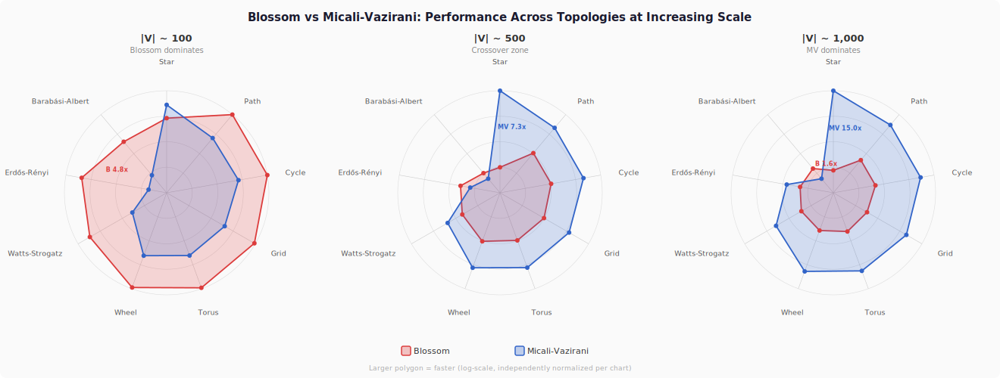

# Blossom vs Micali-Vazirani: Maximum Matching Benchmark

## Abstract

We benchmark two maximum matching algorithms, Blossom \[1\] (O(V^3)) and Micali-Vazirani \[2\] (O(E sqrt(V))), from the [`geometric-traits`](https://github.com/earth-metabolome-initiative/geometric-traits) crate across 210 graph configurations spanning 27 benchmark groups (420 individual measurements). On small graphs (fewer than 500 vertices), Blossom is consistently 2-8x faster due to lower constant overhead. On large sparse graphs, Micali-Vazirani dominates, reaching up to 172x faster on a 10,000-vertex star graph. The crossover point varies between 75 and 750 vertices depending on topology and edge density: sparse and linear structures (stars, paths, grids) cross over earliest, while dense structured bipartite graphs (crown, complete bipartite) favor Blossom at all tested sizes. In general, sparser graphs produce wider performance gaps at scale, while increasing density narrows the difference toward the theoretical O(V^3) vs O(V^2.5) ratio.

## Visual Summary

<p align="center">
  
</p>

Each axis represents a graph topology; a larger polygon indicates a faster algorithm (log-scale).
At V~100, Blossom's red polygon envelops MV's blue on most axes. By V~500 the polygons cross over.
At V~1,000, MV is faster everywhere except on Barabasi-Albert graphs.

## Algorithms Overview

**Blossom** (Edmonds, 1965 \[1\]) finds augmenting paths via a tree-growing strategy with "blossom" contraction to handle odd cycles. Time complexity: **O(V^3)**. The constant factor is small, making it fast on small graphs. The correctness of augmenting-path-based matching algorithms rests on Berge's theorem \[3\].

**Micali-Vazirani** (1980 \[2\]) constructs a layered BFS graph with bridge detection to find augmenting paths in phases. Time complexity: **O(E sqrt(V))**. The per-call overhead is higher, but the algorithm scales better on sparse graphs. A detailed exposition of the algorithm was given by Vazirani \[4\].

| Property | Blossom | Micali-Vazirani |
|:--|:--|:--|
| Time complexity | O(V^3) | O(E sqrt(V)) |
| Small graph performance | Fast (low overhead) | Slower (higher constant) |
| Large sparse graphs | Cubic in V | Sublinear in V for fixed degree |
| Large dense graphs | Cubic in V | Approximately O(V^2.5) |
| Best regime | V < 500, any density | V > 500, sparse graphs |

## Graph Types

The benchmarks use the following graph families. All generators are from the `geometric-traits` crate.

### Classical Structures

- **Path graph** P_n: A linear chain of n vertices. Every vertex has degree 2 except the two endpoints (degree 1). E = V - 1.
- **Cycle graph** C_n: A ring of n vertices, each with degree 2. E = V.
- **Star graph** S_n: One central hub connected to n - 1 leaves. The hub has degree V - 1; all leaves have degree 1. E = V - 1.
- **Wheel graph** W_n: A cycle of n - 1 vertices with one additional hub vertex connected to all of them. E = 2(V - 1).
- **Grid graph** (k x k lattice): Vertices arranged in a square grid. Interior vertices have degree 4; boundary vertices have degree 2 or 3. E approximately 2V for large V.
- **Torus graph**: A grid graph with wrap-around edges on both axes, so every vertex has degree exactly 4. E = 2V.
- **Complete graph** K_n: Every pair of vertices is adjacent. E = V(V - 1)/2.
- **Petersen graph** \[11\]: The standard 10-vertex, 15-edge 3-regular graph, included as a fixed small-graph baseline.

### Bipartite Structures

- **Complete bipartite graph** K_{m,n}: Two disjoint vertex sets of sizes m and n, with every cross-pair connected. E = m * n.
- **Crown graph** C_n: The graph K_{n,n} with one perfect matching removed. Every vertex has degree n - 1. E = n(n - 1). Crown graphs are bipartite but not complete bipartite.
- **Turan graph** T(n, r) \[12\]: The complete r-partite graph with parts as equal as possible. For r = 5 and n = 100, E = 4,000.

### Composite Structures

- **Barbell graph** B(k, p): Two complete graphs K_k joined by a path of p intermediate vertices. Combines dense clique regions with a sparse bridge.
- **Friendship (windmill) graph** F_n \[13\]: n triangles sharing a single vertex. V = 2n + 1, E = 3n. The shared hub has degree 2n; all other vertices have degree 2.
- **Hypercube graph** Q_d: The d-dimensional hypercube with V = 2^d vertices, each of degree d. E = d * 2^(d-1). Vertex-transitive and d-regular.

### Random Graph Models

- **Erdos-Renyi** G(n, m) \[5\]: n vertices with m edges placed uniformly at random. Used in the size-scaling and density-scaling benchmarks with varying n and m.
- **Barabasi-Albert** BA(n, m) \[6\]: Preferential attachment model producing scale-free power-law degree distributions. Starting from a small clique, each new vertex attaches to m existing vertices with probability proportional to their current degree.
- **Watts-Strogatz** WS(n, k, beta) \[7\]: Small-world model. Starts from a k-regular ring lattice and rewires each edge with probability beta, producing short average path lengths and high clustering.
- **Stochastic Block Model** SBM \[8\]: Vertices are partitioned into communities. Edges within a community appear with probability p_in; edges between communities appear with probability p_out (p_in >> p_out).
- **Random Geometric Graph** RGG(n, r) \[9\]: n points placed uniformly in the unit square; edges connect pairs within Euclidean distance r. Produces spatially clustered graphs.
- **Random Regular Graph** RR(n, k) \[10\]: A graph chosen uniformly at random from all k-regular graphs on n vertices.

## Headline Results

The 12 largest speedup ratios observed across all 420 measurements:

| Graph | \|V\| | \|E\| | Blossom | MV | Winner | Speedup | |
|:--|--:|--:|--:|--:|:--|--:|:--|
| Star | 10,000 | 9,999 | 137 ms | **799 µs** | MV | **171.9x** | `████████████████████` |
| Star | 20,000 | 19,999 | 551 ms | **4.52 ms** | MV | **122.0x** | `███████████████████░` |
| Star | 5,000 | 4,999 | 34.5 ms | **404 µs** | MV | **85.3x** | `█████████████████░░░` |
| Friendship | 499 | 747 | 9.47 ms | **142 µs** | MV | **66.2x** | `████████████████░░░░` |
| Cycle | 10,000 | 10,000 | 69.5 ms | **1.41 ms** | MV | **49.2x** | `███████████████░░░░░` |
| Path | 20,000 | 19,999 | 275 ms | **5.74 ms** | MV | **48.0x** | `███████████████░░░░░` |
| Grid | 10,000 | 19,800 | 67.3 ms | **1.44 ms** | MV | **46.8x** | `███████████████░░░░░` |
| Hypercube d14 | 16,384 | 114,688 | 184 ms | **11.2 ms** | MV | **16.5x** | `███████████░░░░░░░░░` |
| Sparse d6 | 10,000 | 30,000 | 125 ms | **11.0 ms** | MV | **11.3x** | `█████████░░░░░░░░░░░` |
| Crown | 50 | 600 | **3.57 µs** | 33.7 µs | Blossom | **9.4x** | `█████████░░░░░░░░░░░` |
| Comp. Bipartite | 20 | 100 | **812 ns** | 6.89 µs | Blossom | **8.5x** | `████████░░░░░░░░░░░░` |
| Crown | 150 | 5,550 | **27.9 µs** | 233 µs | Blossom | **8.4x** | `████████░░░░░░░░░░░░` |

*Bar: log-scale, 20-char width. Bars represent speedup magnitude regardless of winner.*

## Size Scaling

Performance as graph size increases at fixed density levels.

### Sparse Random Graphs (d ~ 6)

Erdos-Renyi G(n, 3n), average degree approximately 6.

| Vertices | Edges | Blossom | MV | Winner | Speedup |
|--:|--:|--:|--:|:--|--:|
| 10 | 30 | **497 ns** | 3.82 µs | Blossom | 7.7x |
| 20 | 60 | **1.10 µs** | 8.59 µs | Blossom | 7.8x |
| 50 | 150 | **3.00 µs** | 15.6 µs | Blossom | 5.2x |
| 100 | 300 | **14.7 µs** | 38.8 µs | Blossom | 2.6x |
| 200 | 600 | **55.2 µs** | 143 µs | Blossom | 2.6x |
| 500 | 1,500 | **251 µs** | 296 µs | Blossom | 1.2x |
| 1,000 | 3,000 | 861 µs | **575 µs** | MV | 1.5x |
| 2,000 | 6,000 | 3.00 ms | **1.27 ms** | MV | 2.4x |
| 3,000 | 9,000 | 10.1 ms | **2.97 ms** | MV | 3.4x |
| 5,000 | 15,000 | 21.1 ms | **4.04 ms** | MV | 5.2x |
| 7,500 | 22,500 | 48.9 ms | **6.71 ms** | MV | 7.3x |
| 10,000 | 30,000 | 125 ms | **11.0 ms** | MV | **11.3x** |

Crossover at approximately 750 vertices.

### Medium Random Graphs (d ~ 20)

Erdos-Renyi G(n, 10n), average degree approximately 20.

| Vertices | Edges | Blossom | MV | Winner | Speedup |
|--:|--:|--:|--:|:--|--:|
| 20 | 190 | **1.94 µs** | 9.25 µs | Blossom | 4.8x |
| 50 | 500 | **7.46 µs** | 28.7 µs | Blossom | 3.9x |
| 100 | 1,000 | **15.5 µs** | 62.8 µs | Blossom | 4.1x |
| 200 | 2,000 | **52.1 µs** | 125 µs | Blossom | 2.4x |
| 500 | 5,000 | **242 µs** | 382 µs | Blossom | 1.6x |
| 1,000 | 10,000 | 904 µs | **781 µs** | MV | 1.2x |
| 2,000 | 20,000 | 3.93 ms | **1.57 ms** | MV | 2.5x |
| 3,000 | 30,000 | 9.63 ms | **3.34 ms** | MV | 2.9x |

Crossover at approximately 750 vertices. Higher density slows the growth of MV's advantage relative to sparse graphs.

### Dense Random Graphs (E = V^2/4)

Erdos-Renyi G(n, n^2/4), approximately 50% edge probability.

| Vertices | Edges | Blossom | MV | Winner | Speedup |
|--:|--:|--:|--:|:--|--:|
| 20 | 100 | **1.11 µs** | 8.32 µs | Blossom | 7.5x |
| 50 | 625 | **7.40 µs** | 25.5 µs | Blossom | 3.4x |
| 100 | 2,500 | **37.1 µs** | 90.2 µs | Blossom | 2.4x |
| 200 | 10,000 | **222 µs** | 302 µs | Blossom | 1.4x |
| 500 | 62,500 | **2.75 ms** | 3.55 ms | Blossom | 1.3x |
| 750 | 140,625 | 8.43 ms | **6.30 ms** | MV | 1.3x |
| 1,000 | 250,000 | 19.4 ms | **13.8 ms** | MV | 1.4x |

Crossover at approximately 600 vertices. Even at V=1,000 the gap is only 1.4x, since E grows as V^2 and O(E sqrt(V)) approaches O(V^2.5), narrowing the difference with O(V^3).

### Complete Graphs

K_n (maximum possible density).

| Vertices | Edges | Blossom | MV | Winner | Speedup |
|--:|--:|--:|--:|:--|--:|
| 10 | 45 | **600 ns** | 3.30 µs | Blossom | 5.5x |
| 20 | 190 | **1.96 µs** | 9.21 µs | Blossom | 4.7x |
| 50 | 1,225 | **18.6 µs** | 39.2 µs | Blossom | 2.1x |
| 100 | 4,950 | **107 µs** | 135 µs | Blossom | 1.3x |
| 200 | 19,900 | 705 µs | **491 µs** | MV | 1.4x |
| 300 | 44,850 | 2.20 ms | **1.08 ms** | MV | 2.0x |
| 400 | 79,800 | 5.00 ms | **1.83 ms** | MV | 2.7x |
| 500 | 124,750 | 9.51 ms | **2.74 ms** | MV | 3.5x |

Crossover at approximately 150 vertices. MV reaches 3.5x at V=500; the O(V^3) vs O(V^2.5) gap grows slowly on dense graphs.

### Grid Graphs

k x k lattice, each interior vertex having degree 4.

| Vertices | Edges | Blossom | MV | Winner | Speedup |
|--:|--:|--:|--:|:--|--:|
| 9 | 12 | **381 ns** | 2.12 µs | Blossom | 5.5x |
| 25 | 40 | **1.02 µs** | 5.65 µs | Blossom | 5.5x |
| 49 | 84 | **3.40 µs** | 11.8 µs | Blossom | 3.5x |
| 100 | 180 | **8.01 µs** | 16.7 µs | Blossom | 2.1x |
| 225 | 420 | **37.4 µs** | 45.4 µs | Blossom | 1.2x |
| 484 | 924 | 158 µs | **75.8 µs** | MV | 2.1x |
| 1,024 | 1,984 | 719 µs | **157 µs** | MV | 4.6x |
| 2,025 | 3,960 | 2.72 ms | **428 µs** | MV | 6.4x |
| 3,025 | 5,940 | 6.36 ms | **635 µs** | MV | **10.0x** |
| 4,900 | 9,660 | 15.7 ms | **749 µs** | MV | **21.0x** |
| 10,000 | 19,800 | 67.3 ms | **1.44 ms** | MV | **46.8x** |

Crossover at approximately 350 vertices. Constant degree means E = O(V), so O(E sqrt(V)) = O(V^1.5) versus Blossom's O(V^3). The 46.8x gap at V=10,000 is the largest observed among regular graph families.

## Density Scaling

How varying edge density affects relative performance at fixed vertex counts.

### V = 100

| Probability | Edges | Blossom | MV | Winner | Speedup |
|--:|--:|--:|--:|:--|--:|
| 0.02 | 80 | **9.79 µs** | 22.7 µs | Blossom | 2.3x |
| 0.05 | 227 | **13.8 µs** | 64.2 µs | Blossom | 4.7x |
| 0.10 | 465 | **11.3 µs** | 50.8 µs | Blossom | 4.5x |
| 0.20 | 956 | **15.7 µs** | 57.7 µs | Blossom | 3.7x |
| 0.30 | 1,472 | **20.5 µs** | 56.6 µs | Blossom | 2.8x |
| 0.50 | 2,496 | **43.2 µs** | 110 µs | Blossom | 2.5x |
| 0.70 | 3,478 | **72.6 µs** | 148 µs | Blossom | 2.0x |
| 0.90 | 4,477 | **104 µs** | 136 µs | Blossom | 1.3x |

At V=100, Blossom wins at all densities. The advantage peaks around p=0.05 (4.7x) and narrows to 1.3x at p=0.9.

### V = 200

| Probability | Edges | Blossom | MV | Winner | Speedup |
|--:|--:|--:|--:|:--|--:|
| 0.02 | 367 | **36.2 µs** | 122 µs | Blossom | 3.4x |
| 0.05 | 956 | **52.2 µs** | 92.2 µs | Blossom | 1.8x |
| 0.10 | 2,002 | **61.4 µs** | 129 µs | Blossom | 2.1x |
| 0.20 | 4,009 | **75.6 µs** | 204 µs | Blossom | 2.7x |
| 0.30 | 5,996 | **138 µs** | 251 µs | Blossom | 1.8x |
| 0.50 | 9,967 | **261 µs** | 377 µs | Blossom | 1.4x |
| 0.70 | 13,966 | **466 µs** | 520 µs | Blossom | 1.1x |
| 0.90 | 17,913 | **687 µs** | 706 µs | Blossom | 1.0x |

At V=200, Blossom wins at all densities, though the margin at p=0.9 is negligible (1.03x).

### V = 500

| Probability | Edges | Blossom | MV | Winner | Speedup |
|--:|--:|--:|--:|:--|--:|
| 0.01 | 1,234 | **260 µs** | 407 µs | Blossom | 1.6x |
| 0.02 | 2,520 | **240 µs** | 289 µs | Blossom | 1.2x |
| 0.05 | 6,246 | **270 µs** | 452 µs | Blossom | 1.7x |
| 0.10 | 12,524 | **423 µs** | 566 µs | Blossom | 1.3x |
| 0.20 | 25,129 | **760 µs** | 1.54 ms | Blossom | 2.0x |
| 0.30 | 37,569 | **1.33 ms** | 2.69 ms | Blossom | 2.0x |
| 0.50 | 62,592 | **3.30 ms** | 3.61 ms | Blossom | 1.1x |

At V=500, Blossom wins at all tested densities, with the advantage peaking at medium densities (p=0.2-0.3).

### V = 1,000

| Probability | Edges | Blossom | MV | Winner | Speedup |
|--:|--:|--:|--:|:--|--:|
| 0.005 | 2,526 | 971 µs | **587 µs** | MV | 1.7x |
| 0.01 | 5,045 | 911 µs | **548 µs** | MV | 1.7x |
| 0.02 | 10,027 | 994 µs | **721 µs** | MV | 1.4x |
| 0.05 | 25,164 | **1.07 ms** | 1.46 ms | Blossom | 1.4x |
| 0.10 | 50,110 | **1.82 ms** | 3.38 ms | Blossom | 1.9x |
| 0.20 | 100,312 | **4.74 ms** | 6.21 ms | Blossom | 1.3x |

At V=1,000, the density crossover is visible: MV wins at low density (p <= 0.02) and Blossom wins at high density (p >= 0.05).

### V = 2,000

| Probability | Edges | Blossom | MV | Winner | Speedup |
|--:|--:|--:|--:|:--|--:|
| 0.005 | 10,034 | 4.14 ms | **1.22 ms** | MV | **3.4x** |
| 0.01 | 20,166 | 3.21 ms | **1.70 ms** | MV | 1.9x |
| 0.02 | 40,119 | 3.71 ms | **2.06 ms** | MV | 1.8x |
| 0.05 | 100,396 | **5.39 ms** | 6.47 ms | Blossom | 1.2x |
| 0.10 | 200,649 | **11.1 ms** | 12.2 ms | Blossom | 1.1x |

At V=2,000, MV wins by 3.4x at p=0.005, while Blossom retains a narrow lead at higher densities. The density crossover shifts toward higher p values as V increases.

## Topology Comparison

All graph types at a fixed vertex count, sorted by MV speedup ratio.

### V ~ 100

| Topology | \|V\| | \|E\| | Blossom | MV | Winner | Speedup |
|:--|--:|--:|--:|--:|:--|--:|
| Petersen | 10 | 15 | **321 ns** | 2.13 µs | Blossom | 6.6x |
| Crown | 100 | 2,450 | **12.6 µs** | 79.9 µs | Blossom | 6.3x |
| Comp. Bipartite | 100 | 2,500 | **12.7 µs** | 79.2 µs | Blossom | 6.2x |
| Erdos-Renyi | 100 | 465 | **10.8 µs** | 51.9 µs | Blossom | 4.8x |
| Watts-Strogatz | 100 | 300 | **10.2 µs** | 31.8 µs | Blossom | 3.1x |
| Barabasi-Albert | 100 | 294 | **16.9 µs** | 46.7 µs | Blossom | 2.8x |
| Torus | 100 | 200 | **7.62 µs** | 16.9 µs | Blossom | 2.2x |
| Grid | 100 | 180 | **7.63 µs** | 16.9 µs | Blossom | 2.2x |
| Wheel | 100 | 198 | **7.69 µs** | 16.9 µs | Blossom | 2.2x |
| Turan | 100 | 4,000 | **86.5 µs** | 182 µs | Blossom | 2.1x |
| Path | 100 | 99 | **7.47 µs** | 15.2 µs | Blossom | 2.0x |
| Cycle | 100 | 100 | **7.46 µs** | 14.7 µs | Blossom | 2.0x |
| Complete | 100 | 4,950 | **106 µs** | 136 µs | Blossom | 1.3x |
| Star | 100 | 99 | 14.1 µs | **10.3 µs** | MV | 1.4x |
| Friendship | 99 | 147 | 109 µs | **30.5 µs** | MV | 3.6x |

At V~100, Blossom wins on 13 of 15 topologies. The two MV wins (star and friendship) both have structural properties that increase the number of augmentation steps for Blossom.

### V ~ 500

| Topology | \|V\| | \|E\| | Blossom | MV | Winner | Speedup |
|:--|--:|--:|--:|--:|:--|--:|
| Erdos-Renyi | 500 | 2,520 | **224 µs** | 289 µs | Blossom | 1.3x |
| Barbell | 110 | 2,461 | **61.7 µs** | 82.1 µs | Blossom | 1.3x |
| Barabasi-Albert | 500 | 1,494 | **325 µs** | 392 µs | Blossom | 1.2x |
| Watts-Strogatz | 500 | 1,500 | 204 µs | **132 µs** | MV | 1.5x |
| Grid | 506 | 967 | 169 µs | **80.3 µs** | MV | 2.1x |
| Torus | 506 | 1,012 | 169 µs | **80.3 µs** | MV | 2.1x |
| Wheel | 500 | 998 | 165 µs | **79.9 µs** | MV | 2.1x |
| Cycle | 500 | 500 | 165 µs | **70.5 µs** | MV | 2.3x |
| Path | 500 | 499 | 165 µs | **70.2 µs** | MV | 2.4x |
| Star | 500 | 499 | 326 µs | **44.9 µs** | MV | 7.3x |
| Friendship | 499 | 747 | 9.47 ms | **142 µs** | MV | **66.2x** |

At V~500, MV wins on 8 of 11 topologies. The friendship graph (a windmill of 249 triangles sharing a single vertex) is a pathological case for Blossom, which requires 66x more time than MV.

### V ~ 1,000

| Topology | \|V\| | \|E\| | Blossom | MV | Winner | Speedup |
|:--|--:|--:|--:|--:|:--|--:|
| Barabasi-Albert | 1,000 | 2,994 | **946 µs** | 1.49 ms | Blossom | 1.6x |
| Erdos-Renyi | 1,000 | 5,045 | 881 µs | **556 µs** | MV | 1.6x |
| Watts-Strogatz | 1,000 | 3,000 | 791 µs | **293 µs** | MV | 2.7x |
| Torus | 1,024 | 2,048 | 682 µs | **164 µs** | MV | 4.2x |
| Wheel | 1,000 | 1,998 | 708 µs | **161 µs** | MV | 4.4x |
| Grid | 1,024 | 1,984 | 740 µs | **158 µs** | MV | 4.7x |
| Cycle | 1,000 | 1,000 | 649 µs | **136 µs** | MV | 4.7x |
| Path | 1,000 | 999 | 649 µs | **136 µs** | MV | 4.8x |
| Star | 1,000 | 999 | 1.29 ms | **86.2 µs** | MV | **15.0x** |

At V~1,000, MV wins on 8 of 9 topologies. Barabasi-Albert graphs (power-law degree distribution with high-degree hubs) are the sole remaining Blossom win.

## Real-World Graph Models

Performance on graph models commonly used in network science.

### Barabasi-Albert (m = 2)

Scale-free power-law graph, approximately 4 edges per vertex.

| Vertices | Edges | Blossom | MV | Winner | Speedup |
|--:|--:|--:|--:|:--|--:|
| 50 | 97 | **4.08 µs** | 14.0 µs | Blossom | 3.4x |
| 100 | 197 | **11.7 µs** | 34.1 µs | Blossom | 2.9x |
| 200 | 397 | **40.1 µs** | 72.6 µs | Blossom | 1.8x |
| 500 | 997 | **215 µs** | 220 µs | Blossom | 1.0x |
| 1,000 | 1,997 | 833 µs | **566 µs** | MV | 1.5x |
| 2,000 | 3,997 | 3.51 ms | **1.32 ms** | MV | 2.7x |
| 5,000 | 9,997 | 21.0 ms | **3.86 ms** | MV | **5.4x** |

Crossover at approximately 500 vertices.

### Barabasi-Albert (m = 5)

Denser scale-free graph, approximately 10 edges per vertex.

| Vertices | Edges | Blossom | MV | Winner | Speedup |
|--:|--:|--:|--:|:--|--:|
| 50 | 235 | **6.42 µs** | 23.5 µs | Blossom | 3.7x |
| 100 | 485 | **19.5 µs** | 50.5 µs | Blossom | 2.6x |
| 200 | 985 | **57.2 µs** | 101 µs | Blossom | 1.8x |
| 500 | 2,485 | **319 µs** | 324 µs | Blossom | 1.0x |
| 1,000 | 4,985 | 1.21 ms | **659 µs** | MV | 1.8x |
| 2,000 | 9,985 | 4.18 ms | **1.62 ms** | MV | 2.6x |
| 5,000 | 24,985 | 23.5 ms | **4.73 ms** | MV | **5.0x** |

Crossover at approximately 500 vertices. Higher m slightly delays the crossover relative to m=2.

### Watts-Strogatz (k = 6, beta = 0.3)

Small-world network, 6 edges per vertex.

| Vertices | Edges | Blossom | MV | Winner | Speedup |
|--:|--:|--:|--:|:--|--:|
| 50 | 150 | **3.66 µs** | 14.3 µs | Blossom | 3.9x |
| 100 | 300 | **10.4 µs** | 30.6 µs | Blossom | 2.9x |
| 200 | 600 | **38.2 µs** | 56.2 µs | Blossom | 1.5x |
| 500 | 1,500 | 211 µs | **133 µs** | MV | 1.6x |
| 1,000 | 3,000 | 867 µs | **301 µs** | MV | 2.9x |
| 2,000 | 6,000 | 3.39 ms | **656 µs** | MV | 5.2x |
| 5,000 | 15,000 | 20.6 ms | **1.90 ms** | MV | **10.8x** |

Crossover at approximately 350 vertices. The low effective diameter of small-world graphs benefits MV's BFS-based phases.

### Watts-Strogatz (k = 10, beta = 0.5)

Denser small-world network, 10 edges per vertex.

| Vertices | Edges | Blossom | MV | Winner | Speedup |
|--:|--:|--:|--:|:--|--:|
| 50 | 250 | **4.51 µs** | 18.4 µs | Blossom | 4.1x |
| 100 | 500 | **11.0 µs** | 34.6 µs | Blossom | 3.1x |
| 200 | 1,000 | **39.3 µs** | 90.5 µs | Blossom | 2.3x |
| 500 | 2,500 | **203 µs** | 213 µs | Blossom | 1.0x |
| 1,000 | 5,000 | 803 µs | **384 µs** | MV | 2.1x |
| 2,000 | 10,000 | 3.20 ms | **791 µs** | MV | 4.0x |
| 5,000 | 25,000 | 20.7 ms | **2.33 ms** | MV | **8.9x** |

Crossover at approximately 500 vertices.

### Stochastic Block Model

Two communities (n/2 each), p_in = 0.3, p_out = 0.01.

| Vertices | Edges | Blossom | MV | Winner | Speedup |
|--:|--:|--:|--:|:--|--:|
| 50 | 176 | **4.90 µs** | 15.8 µs | Blossom | 3.2x |
| 100 | 726 | **13.4 µs** | 41.8 µs | Blossom | 3.1x |
| 200 | 3,068 | **64.5 µs** | 151 µs | Blossom | 2.3x |
| 500 | 19,431 | **652 µs** | 751 µs | Blossom | 1.2x |
| 1,000 | 76,893 | 4.26 ms | **2.56 ms** | MV | 1.7x |
| 2,000 | 309,322 | 29.4 ms | **10.5 ms** | MV | 2.8x |

Crossover at approximately 750 vertices. The high intra-cluster density (p=0.3) keeps E/V high, delaying the crossover.

### Random Geometric Graph

Vertices placed uniformly in a unit square; edges connect pairs within radius r, calibrated for average degree approximately 6.

| Vertices | Edges | Blossom | MV | Winner | Speedup |
|--:|--:|--:|--:|:--|--:|
| 50 | 127 | **5.37 µs** | 28.7 µs | Blossom | 5.3x |
| 100 | 268 | **19.2 µs** | 61.7 µs | Blossom | 3.2x |
| 200 | 602 | **81.6 µs** | 200 µs | Blossom | 2.5x |
| 500 | 1,451 | **309 µs** | 478 µs | Blossom | 1.5x |
| 1,000 | 3,013 | 1.36 ms | **1.26 ms** | MV | 1.1x |
| 2,000 | 5,874 | 6.32 ms | **3.23 ms** | MV | 2.0x |
| 5,000 | 14,949 | 36.8 ms | **9.33 ms** | MV | **3.9x** |

Crossover at approximately 750 vertices. Spatial clustering in the edge structure appears to benefit Blossom relative to other sparse models at the same average degree.

### Random Regular (k = 4)

Every vertex has exactly degree 4.

| Vertices | Edges | Blossom | MV | Winner | Speedup |
|--:|--:|--:|--:|:--|--:|
| 50 | 100 | **3.24 µs** | 17.2 µs | Blossom | 5.3x |
| 100 | 200 | **10.8 µs** | 33.9 µs | Blossom | 3.1x |
| 200 | 400 | **30.6 µs** | 70.5 µs | Blossom | 2.3x |
| 500 | 1,000 | 240 µs | **169 µs** | MV | 1.4x |
| 1,000 | 2,000 | 841 µs | **403 µs** | MV | 2.1x |
| 2,000 | 4,000 | 3.24 ms | **867 µs** | MV | 3.7x |
| 5,000 | 10,000 | 21.4 ms | **2.33 ms** | MV | **9.2x** |

Crossover at approximately 350 vertices. The profile closely matches grid graphs: constant-degree graphs yield E = O(V), making O(E sqrt(V)) = O(V^1.5).

## Extreme and Pathological Cases

### Star Graphs

One central hub connected to all other vertices (E = V - 1). This topology produces the largest observed MV advantage.

| Vertices | Edges | Blossom | MV | Winner | Speedup |
|--:|--:|--:|--:|:--|--:|
| 50 | 49 | **4.00 µs** | 5.86 µs | Blossom | 1.5x |
| 100 | 99 | 14.7 µs | **10.5 µs** | MV | 1.4x |
| 500 | 499 | 340 µs | **45.7 µs** | MV | **7.4x** |
| 1,000 | 999 | 1.36 ms | **85.7 µs** | MV | **15.9x** |
| 5,000 | 4,999 | 34.5 ms | **404 µs** | MV | **85.3x** |
| 10,000 | 9,999 | 137 ms | **799 µs** | MV | **171.9x** |
| 20,000 | 19,999 | 551 ms | **4.52 ms** | MV | **122.0x** |

Peak speedup occurs at V=10,000 (171.9x). With E = V - 1, each augmenting path traverses the hub, and Blossom's O(V^3) behavior is fully realized. MV's BFS phases complete in O(V) time.

The ratio decreases from 171.9x at V=10,000 to 122.0x at V=20,000, likely due to increased cache pressure in MV at larger working set sizes.

### Path Graphs

Linear chain of vertices (E = V - 1).

| Vertices | Edges | Blossom | MV | Winner | Speedup |
|--:|--:|--:|--:|:--|--:|
| 50 | 49 | **3.89 µs** | 8.70 µs | Blossom | 2.2x |
| 100 | 99 | **7.72 µs** | 16.5 µs | Blossom | 2.1x |
| 500 | 499 | 171 µs | **75.6 µs** | MV | 2.3x |
| 1,000 | 999 | 679 µs | **150 µs** | MV | 4.5x |
| 5,000 | 4,999 | 17.3 ms | **706 µs** | MV | **24.5x** |
| 10,000 | 9,999 | 68.9 ms | **1.42 ms** | MV | **48.4x** |
| 20,000 | 19,999 | 275 ms | **5.74 ms** | MV | **48.0x** |

Crossover at approximately 250 vertices. The profile is nearly identical to cycle graphs.

### Cycle Graphs

Ring of vertices (E = V).

| Vertices | Edges | Blossom | MV | Winner | Speedup |
|--:|--:|--:|--:|:--|--:|
| 50 | 50 | **2.27 µs** | 8.96 µs | Blossom | 3.9x |
| 100 | 100 | **7.75 µs** | 17.0 µs | Blossom | 2.2x |
| 500 | 500 | 171 µs | **77.2 µs** | MV | 2.2x |
| 1,000 | 1,000 | 684 µs | **151 µs** | MV | 4.5x |
| 5,000 | 5,000 | 17.2 ms | **696 µs** | MV | **24.7x** |
| 10,000 | 10,000 | 69.5 ms | **1.41 ms** | MV | **49.2x** |
| 20,000 | 20,000 | 277 ms | **5.75 ms** | MV | **48.2x** |

Crossover at approximately 250 vertices. The ratio plateaus around 48x between V=10,000 and V=20,000, suggesting both algorithms encounter similar memory-hierarchy effects at this scale.

### Hypercube Graphs

d-dimensional hypercube: V = 2^d, each vertex has degree d.

| Dimension | Vertices | Edges | Blossom | MV | Winner | Speedup |
|--:|--:|--:|--:|--:|:--|--:|
| 4 | 16 | 32 | **480 ns** | 3.25 µs | Blossom | 6.8x |
| 6 | 64 | 192 | **3.76 µs** | 14.9 µs | Blossom | 4.0x |
| 8 | 256 | 1,024 | **47.6 µs** | 61.3 µs | Blossom | 1.3x |
| 10 | 1,024 | 5,120 | 720 µs | **321 µs** | MV | 2.2x |
| 12 | 4,096 | 24,576 | 11.6 ms | **2.54 ms** | MV | 4.6x |
| 14 | 16,384 | 114,688 | 184 ms | **11.2 ms** | MV | **16.5x** |

Crossover between d=8 (V=256) and d=10 (V=1,024). Degree grows as log(V), so hypercubes remain relatively sparse at large V.

### Barbell Graphs

Two complete graphs K_k connected by a path of length p.

| Config | Vertices | Edges | Blossom | MV | Winner | Speedup |
|:--|--:|--:|--:|--:|:--|--:|
| k=10, p=0 | 20 | 91 | **1.20 µs** | 6.14 µs | Blossom | 5.1x |
| k=20, p=0 | 40 | 381 | **5.74 µs** | 17.7 µs | Blossom | 3.1x |
| k=20, p=20 | 60 | 401 | **8.50 µs** | 20.2 µs | Blossom | 2.4x |
| k=10, p=50 | 70 | 141 | **5.53 µs** | 14.1 µs | Blossom | 2.6x |
| k=50, p=0 | 100 | 2,451 | **57.2 µs** | 78.8 µs | Blossom | 1.4x |
| k=50, p=10 | 110 | 2,461 | **62.7 µs** | 85.8 µs | Blossom | 1.4x |
| k=100, p=0 | 200 | 9,901 | 365 µs | **276 µs** | MV | 1.3x |

Crossover at approximately 150 vertices. The dense clique components favor Blossom at small sizes.

### Crown Graphs

Crown graph C_n: complete bipartite K_{n,n} minus a perfect matching. Blossom wins at all tested sizes.

| Vertices | Edges | Blossom | MV | Winner | Speedup |
|--:|--:|--:|--:|:--|--:|
| 20 | 90 | **781 ns** | 6.53 µs | Blossom | 8.4x |
| 50 | 600 | **3.57 µs** | 33.7 µs | Blossom | **9.4x** |
| 100 | 2,450 | **12.8 µs** | 83.1 µs | Blossom | 6.5x |
| 150 | 5,550 | **27.9 µs** | 233 µs | Blossom | 8.4x |
| 200 | 9,900 | **55.7 µs** | 335 µs | Blossom | 6.0x |
| 300 | 22,350 | **124 µs** | 723 µs | Blossom | 5.8x |
| 400 | 39,800 | **220 µs** | 1.01 ms | Blossom | 4.6x |

Blossom wins at every tested size by 4.6-9.4x. Crown graphs (K_{n,n} with one perfect matching removed) have a structure that Blossom handles efficiently. The advantage narrows with increasing V but remains substantial at V=400.

### Complete Bipartite Graphs

K_{m,n} with varying balance.

| Config | Vertices | Edges | Blossom | MV | Winner | Speedup |
|:--|--:|--:|--:|--:|:--|--:|
| 10 x 10 | 20 | 100 | **812 ns** | 6.89 µs | Blossom | 8.5x |
| 25 x 25 | 50 | 625 | **3.52 µs** | 26.5 µs | Blossom | 7.5x |
| 50 x 50 | 100 | 2,500 | **12.8 µs** | 80.5 µs | Blossom | 6.3x |
| 10 x 100 | 110 | 1,000 | **39.9 µs** | 49.0 µs | Blossom | 1.2x |
| 100 x 100 | 200 | 10,000 | **48.3 µs** | 289 µs | Blossom | 6.0x |
| 50 x 200 | 250 | 10,000 | 881 µs | **369 µs** | MV | 2.4x |

Balanced complete bipartite graphs (N x N) favor Blossom by 6-8.5x. Asymmetric configurations reduce the gap; the 50x200 case is the only MV win.

## Crossover Analysis

The vertex count at which MV overtakes Blossom depends on edge density and graph structure:

| Graph Family | Avg Degree | Approx. Crossover \|V\| |
|:--|--:|--:|
| Star | 2 | ~75 |
| Complete | V-1 | ~150 |
| Barbell | varies | ~150 |
| Path / Cycle | 2 | ~250 |
| Grid | ~4 | ~350 |
| Random Regular k=4 | 4 | ~350 |
| Watts-Strogatz k=6 | 6 | ~350 |
| Barabasi-Albert m=2 | ~4 | ~500 |
| Barabasi-Albert m=5 | ~10 | ~500 |
| Watts-Strogatz k=10 | 10 | ~500 |
| Dense half (E=V^2/4) | V/2 | ~600 |
| Sparse d6 | 6 | ~750 |
| Medium d20 | 20 | ~750 |
| Random Geometric | ~6 | ~750 |
| Stochastic Block Model | varies | ~750 |
| Crown | n-1 | >400 (Blossom always) |
| Comp. Bipartite (NxN) | n | >200 (Blossom always) |

The crossover is not a simple function of average degree. Structural properties also matter: dense bipartite graphs (crown, complete bipartite) consistently favor Blossom regardless of size, while star graphs cross over at the smallest vertex count despite minimal average degree, because every augmenting path must pass through the central hub.

## Scaling Visualization

Speedup ratio as graph size increases. Bar length is proportional to log(ratio).

### Sparse Random Graphs (d ~ 6)

```
               Blossom faster            MV faster
              ◄────────────────────┼────────────────────►
V10       ████████████████████ │                      Blossom  7.7x
V20       ████████████████████ │                      Blossom  7.8x
V50          █████████████████ │                      Blossom  5.2x
V100              ████████████ │                      Blossom  2.6x
V200              ████████████ │                      Blossom  2.6x
V500                       ██ │                      Blossom  1.2x
V1k                           │ ███                  MV       1.5x
V2k                           │ ███████              MV       2.4x
V3k                           │ ██████████           MV       3.4x
V5k                           │ ██████████████       MV       5.2x
V7.5k                         │ ████████████████     MV       7.3x
V10k                          │ ████████████████████ MV      11.3x
```

### Grid Graphs

```
               Blossom faster            MV faster
              ◄────────────────────┼────────────────────►
V9        ████████████████████ │                      Blossom  5.5x
V25       ████████████████████ │                      Blossom  5.5x
V49          ███████████████   │                      Blossom  3.5x
V100              █████████    │                      Blossom  2.1x
V225                      ██  │                      Blossom  1.2x
V484                          │ ████                 MV       2.1x
V1024                         │ ████████             MV       4.6x
V2025                         │ ██████████           MV       6.4x
V3025                         │ ████████████         MV      10.0x
V4900                         │ ████████████████     MV      21.0x
V10000                        │ ████████████████████ MV      46.8x
```

## Methodology

- **Framework:** [Criterion.rs](https://github.com/bheisler/criterion.rs) 0.8 with HTML reports
- **Timing:** Median of adaptive sample sizes (10-100 iterations, 10-60s measurement time)
- **Graph representation:** `SymmetricCSR2D<CSR2D<usize, usize, usize>>` from `geometric-traits`
- **Random seed:** All random graphs seeded with `42` for reproducibility
- **Compilation:** `--release` (optimized), single-threaded

### Benchmark Suites

| Suite | Groups | Configurations | Focus |
|:--|--:|--:|:--|
| `scaling_with_size` | 5 | 46 | Fixed density, varying vertex count |
| `scaling_with_density` | 5 | 34 | Fixed vertices, varying edge probability |
| `topology_comparison` | 3 | 35 | All graph types at fixed vertex count |
| `realworld_structures` | 7 | 48 | Network science graph models |
| `extreme_cases` | 7 | 47 | Pathological and structured graphs |
| **Total** | **27** | **210** | **420 data points** |

## Reproducing

```bash
# Run all benchmarks (~2-3 hours)
cargo bench

# Run individual suites
cargo bench --bench scaling_with_size
cargo bench --bench scaling_with_density
cargo bench --bench topology_comparison
cargo bench --bench realworld_structures
cargo bench --bench extreme_cases
```

Results are stored in `target/criterion/` with HTML reports viewable at `target/criterion/report/index.html`.

## References

\[1\] J. Edmonds, "Paths, Trees, and Flowers," *Canadian Journal of Mathematics*, vol. 17, pp. 449-467, 1965. [doi:10.4153/CJM-1965-045-4](https://doi.org/10.4153/CJM-1965-045-4)

\[2\] S. Micali and V. V. Vazirani, "An O(sqrt(|V|) * |E|) Algorithm for Finding Maximum Matching in General Graphs," in *Proc. 21st Annual IEEE Symposium on Foundations of Computer Science (FOCS)*, pp. 17-27, 1980. [doi:10.1109/SFCS.1980.12](https://doi.org/10.1109/SFCS.1980.12)

\[3\] C. Berge, "Two Theorems in Graph Theory," *Proceedings of the National Academy of Sciences*, vol. 43, no. 9, pp. 842-844, 1957. [doi:10.1073/pnas.43.9.842](https://doi.org/10.1073/pnas.43.9.842)

\[4\] V. V. Vazirani, "A Simplification of the MV Matching Algorithm and its Proof," *arXiv:2312.03515*, 2024. [arXiv:2312.03515](https://arxiv.org/abs/2312.03515)

\[5\] P. Erdos and A. Renyi, "On Random Graphs I," *Publicationes Mathematicae Debrecen*, vol. 6, pp. 290-297, 1959.

\[6\] A.-L. Barabasi and R. Albert, "Emergence of Scaling in Random Networks," *Science*, vol. 286, no. 5439, pp. 509-512, 1999. [doi:10.1126/science.286.5439.509](https://doi.org/10.1126/science.286.5439.509)

\[7\] D. J. Watts and S. H. Strogatz, "Collective dynamics of 'small-world' networks," *Nature*, vol. 393, no. 6684, pp. 440-442, 1998. [doi:10.1038/30918](https://doi.org/10.1038/30918)

\[8\] P. W. Holland, K. B. Laskey, and S. Leinhardt, "Stochastic blockmodels: First steps," *Social Networks*, vol. 5, no. 2, pp. 109-137, 1983. [doi:10.1016/0378-8733(83)90021-7](https://doi.org/10.1016/0378-8733(83)90021-7)

\[9\] E. N. Gilbert, "Random Plane Networks," *Journal of the Society for Industrial and Applied Mathematics*, vol. 9, no. 4, pp. 533-543, 1961. [doi:10.1137/0109045](https://doi.org/10.1137/0109045)

\[10\] A. Steger and N. C. Wormald, "Generating random regular graphs quickly," *Combinatorics, Probability and Computing*, vol. 8, no. 4, pp. 377-396, 1999. [doi:10.1017/S0963548399003867](https://doi.org/10.1017/S0963548399003867)

\[11\] J. Petersen, "Die Theorie der regularen graphs," *Acta Mathematica*, vol. 15, pp. 193-220, 1891. [doi:10.1007/BF02392606](https://doi.org/10.1007/BF02392606)

\[12\] P. Turan, "On an extremal problem in graph theory," *Matematikai es Fizikai Lapok*, vol. 48, pp. 436-452, 1941.

\[13\] P. Erdos, A. Renyi, and V. T. Sos, "On a problem of graph theory," *Studia Scientiarum Mathematicarum Hungarica*, vol. 1, pp. 215-235, 1966.
