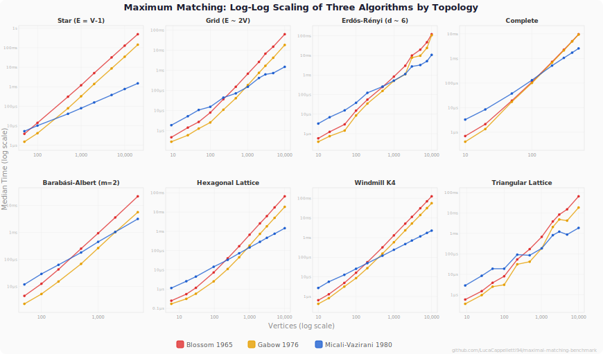
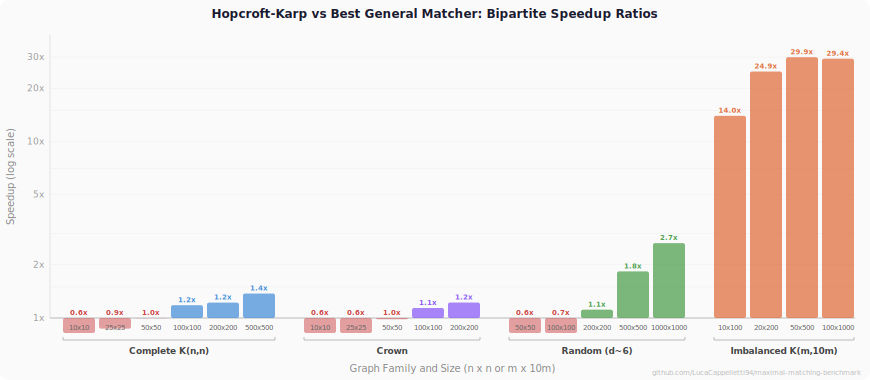

# Maximum Matching Benchmark Suite

[](https://github.com/LucaCappelletti94/maximal-matching-benchmark/actions/workflows/ci.yml)
[](https://github.com/LucaCappelletti94/maximal-matching-benchmark/blob/main/LICENSE)
[](https://doi.org/10.5281/zenodo.19164092)

## Abstract

We implemented and benchmark four static, unweighted maximum-cardinality matching algorithms in the [`geometric-traits`](https://github.com/earth-metabolome-initiative/geometric-traits) Rust crate: three general-graph algorithms, Blossom \[1\], Gabow 1976 \[16\], and Micali-Vazirani \[2\], plus the specialized bipartite algorithm Hopcroft-Karp \[15\]. The current versioned benchmark snapshot covers graph configurations across benchmark groups. Raw Criterion.rs results are archived on [Zenodo](https://doi.org/10.5281/zenodo.19164092).

Winner breakdown (strict lowest-median):

| Family | Wins | Typical regime |
|:--|--:|:--|
| Gabow 1976 | 184 | Most small-to-medium general graphs |
| Micali-Vazirani | 84 | Large sparse and windmill-like inputs |
| Hopcroft-Karp | 12 | Sparse/imbalanced bipartite inputs |
| Blossom | 9 | Small dense baseline |

## Table of Contents

- [Decision Guide](#decision-guide)
- [Visual Summary](#visual-summary)
- [Algorithms Overview](#algorithms-overview)
- [What Problems These Algorithms Solve](#what-problems-these-algorithms-solve)
- [Graph Types](#graph-types)
- [Headline Results](#headline-results)
- [Bipartite Matching Comparison](#bipartite-matching-comparison)
- [Threats to Validity](#threats-to-validity)
- [Methodology](#methodology)
- [Reproducing](#reproducing)
- [References](#references)

## Decision Guide

Scope: **unweighted maximum-cardinality matching on static graphs** only.

1. **Bipartite?** Use Hopcroft-Karp on sparse/imbalanced inputs. On small dense balanced inputs, Gabow 1976 can be faster.
2. **General graph?** Start with Gabow 1976 (most common winner overall).
3. **Large and sparse?** Benchmark Micali-Vazirani (dominates stars, paths, cycles, windmills at scale).

## Visual Summary

<p align="center">
  
</p>

Each axis represents a graph topology; a larger polygon indicates a faster algorithm (log-scale). Red = Blossom, orange = Gabow 1976, blue = Micali-Vazirani.
At V~100 and V~500, Gabow's orange polygon encloses most axes. By V~1,000, Micali-Vazirani pulls ahead on the sparse axes. At V~2,000, MV dominates most sparse topologies.

Polygons are normalized log-scale within each panel (not comparable across panels).

### Scaling Behavior

<p align="center">
  
</p>

On stars, MV separates earliest; dense families compress the gap between all solvers.

### Bipartite Speedup

<p align="center">
  
</p>

Gabow 1976 beats HK on small/dense balanced bipartite inputs; HK dominates at larger sizes and on imbalanced inputs (14-30x).

## Algorithms Overview

**Blossom** (Edmonds, 1965 \[1\]) finds augmenting paths via tree-growing with blossom contraction (shrinking odd cycles to preserve augmenting-path structure). The `geometric-traits` implementation uses linear-scan contraction, giving **O(V^2 E)** worst-case time. Fast on small graphs due to low constant overhead. Correctness rests on Berge's theorem \[3\].

**Gabow 1976** \[16\] is a more efficient implementation of Edmonds-style blossom matching. It still targets general graphs and carries the same O(V^3) worst-case bound as classical blossom-based methods, but with much smaller constants in practice. In the committed snapshot, plain `Gabow1976` is the single most common winner.

**Micali-Vazirani** (1980 \[2\]) finds augmenting paths in phases via layered BFS with bridge detection. Time complexity: **O(E sqrt(V))**. Higher per-call overhead but scales better on sparse graphs. The `geometric-traits` implementation follows Peterson & Loui \[17\], ported from ggawryal/MV-matching (C++). To our knowledge, this is the first Rust implementation of Micali-Vazirani.

**Hopcroft-Karp** (1973 \[15\]) finds maximum cardinality matchings in bipartite graphs using layered BFS to discover shortest augmenting paths in phases. Time complexity: **O(E sqrt(V))**. Because it operates directly on the bipartite adjacency (rows = one partition, columns = the other), it avoids the overhead of general-graph blossom contraction entirely.

| Property | Blossom | Gabow 1976 | Micali-Vazirani |
|:--|:--|:--|:--|
| Time complexity | O(V^2 E) | O(V^3) | O(E sqrt(V)) |
| Graph type | General | General | General |
| Typical role in this suite | Textbook baseline | Most common overall winner | Large sparse specialist |
| Small graph performance | Good | Best of the general algorithms on many inputs | Higher constant overhead |
| Large sparse graphs | O(V^3) when E = O(V) | Better constants, still cubic worst-case | Approximately O(V^1.5) for fixed degree |
| Best regime | Small dense baseline | Small-to-medium general graphs | Large sparse graphs |

Across the **full bipartite suite**, Hopcroft-Karp wins 12 of 20 configurations, while `Gabow1976` wins the other 8 smaller or denser balanced cases. See the [Bipartite Matching Comparison](#bipartite-matching-comparison) section.

## What Problems These Algorithms Solve

A maximum matching is the largest possible set of edges that do not share vertices.
In plain terms, it answers: **how do I create as many disjoint one-to-one pairs as possible?**
Blossom, Gabow 1976, and Micali-Vazirani solve this problem on **general graphs**, so they work even when
the compatibility graph is not bipartite and contains odd cycles.

| Real-world task | Matching interpretation |
|:--|:--|
| Peer review, mentoring, pair programming, partner work | Vertices are people; an edge means two people can be paired. A maximum matching finds the largest set of simultaneous pairings. |
| Exchange and swap problems | Vertices are participants or assets; an edge means a feasible swap or exchange. Matching maximizes how many deals can happen at once. |
| Communication and network scheduling | Vertices are endpoints; an edge means a direct link can be activated. Matching selects the largest set of non-conflicting simultaneous links. |
| Molecular graph analysis | In chemistry, matchings and perfect matchings appear in analyses such as Kekule structures and resonance patterns in conjugated molecules. |
| Graph coarsening and preprocessing | Matching can be used to merge or pair nearby vertices before partitioning, sparsification, or multilevel graph algorithms. |
| Resource pairing in fleets, robotics, or sensor systems | Vertices are units; an edge means two units can be paired under distance, compatibility, or safety constraints. |

All algorithm families compute maximum-cardinality matchings; see the [Decision Guide](#decision-guide) for when to use each. If your problem is weighted or preference-based, a different formulation may fit better:

- **Bipartite cardinality matching:** often solved with specialized bipartite algorithms such as Hopcroft-Karp.
- **Weighted one-to-one assignment:** use maximum-weight matching or Hungarian/min-cost-flow style methods.
- **Stable matching:** use stable marriage / stable roommates algorithms, since maximum matching does not optimize for stability or preference satisfaction.

## Graph Types

The benchmarks use the following graph families. Most generators are from the `geometric-traits` crate; the sparse random bipartite benchmark in the Hopcroft-Karp comparison uses a small inline seeded generator to build equivalent bipartite and symmetric inputs.

### Classical Structures

- **Path graph** P_n: A linear chain of n vertices. Every vertex has degree 2 except the two endpoints (degree 1). E = V - 1.
- **Cycle graph** C_n: A ring of n vertices, each with degree 2. E = V.
- **Star graph** S_n: One central hub connected to n - 1 leaves. The hub has degree V - 1; all leaves have degree 1. E = V - 1.
- **Wheel graph** W_n: A cycle of n - 1 vertices with one additional hub vertex connected to all of them. E = 2(V - 1).
- **Grid graph** (k x k lattice): Vertices arranged in a square grid. Interior vertices have degree 4; boundary vertices have degree 2 or 3. E approximately 2V for large V.
- **Torus graph**: A grid graph with wrap-around edges on both axes, so every vertex has degree exactly 4. E = 2V.
- **Hexagonal lattice graph**: A honeycomb-style lattice. Interior vertices have degree 3. The benchmark uses rectangular `rows x cols` slices with boundary effects at small sizes.
- **Triangular lattice graph**: A triangular tiling. Interior vertices have degree 6. It is denser than the square grid or torus at the same vertex count.
- **Complete graph** K_n: Every pair of vertices is adjacent. E = V(V - 1)/2.
- **Petersen graph** \[11\]: The standard 10-vertex, 15-edge 3-regular graph, included as a fixed small-graph baseline.

### Bipartite Structures

- **Complete bipartite graph** K_{m,n}: Two disjoint vertex sets of sizes m and n, with every cross-pair connected. E = m * n.
- **Crown graph** C_n: The graph K_{n,n} with one perfect matching removed. Every vertex has degree n - 1. E = n(n - 1). Crown graphs are bipartite but not complete bipartite.
- **Turan graph** T(n, r) \[12\]: The complete r-partite graph with parts as equal as possible. For r = 5 and n = 100, E = 4,000.

### Composite Structures

- **Barbell graph** B(k, p): Two complete graphs K_k joined by a path of p intermediate vertices. Combines dense clique regions with a sparse bridge.
- **Friendship (windmill) graph** F_n \[13\]: n triangles sharing a single vertex. V = 2n + 1, E = 3n. The shared hub has degree 2n; all other vertices have degree 2.
- **Windmill K4 graph**: n copies of K4 sharing one hub vertex. In the benchmarked `clique_size = 4` case, V = 3n + 1 and E = 6n.
- **Hypercube graph** Q_d: The d-dimensional hypercube with V = 2^d vertices, each of degree d. E = d * 2^(d-1). Vertex-transitive and d-regular.

### Random Graph Models

- **Erdos-Renyi** G(n, m) \[5\]: n vertices with m edges placed uniformly at random. Used in the size-scaling benchmarks with varying n and m.
- **Erdos-Renyi** G(n, p) \[5\]: each possible edge appears independently with probability p. Used in the density-scaling benchmarks and the fixed-size topology snapshots.
- **Barabasi-Albert** BA(n, m) \[6\]: Preferential attachment model producing scale-free power-law degree distributions. Starting from a small clique, each new vertex attaches to m existing vertices with probability proportional to their current degree.
- **Watts-Strogatz** WS(n, k, beta) \[7\]: Small-world model. Starts from a k-regular ring lattice and rewires each edge with probability beta, producing short average path lengths and high clustering.
- **Stochastic Block Model** SBM \[8\]: Vertices are partitioned into communities. Edges within a community appear with probability p_in; edges between communities appear with probability p_out (p_in >> p_out).
- **Random Geometric Graph** RGG(n, r) \[9\]: n points placed uniformly in the unit square; edges connect pairs within Euclidean distance r. Produces spatially clustered graphs.
- **Random Regular Graph** RR(n, k) \[10\]: A graph chosen uniformly at random from all k-regular graphs on n vertices.
- **Random Bipartite** G(n, n, p approx 6/n): seeded bipartite generator used in `bipartite/random`, with about six neighbors per left-partition vertex on average.

## Headline Results

The 12 largest **winner-vs-runner-up** speedup ratios across the full suite, using the versioned `median_ns` snapshot archived on [Zenodo](https://doi.org/10.5281/zenodo.19164092):

| Family | Config | \|V\| | \|E\| | Winner | Runner-up | Winner Time | Runner-up Time | Speedup |
|:--|:--|--:|--:|:--|:--|--:|--:|--:|
| Imbalanced Bipartite | `50x500_V550_E25000` | 550 | 25000 | HopcroftKarp | MicaliVazirani | **26.53 us** | 794.18 us | **29.9x** |
| Imbalanced Bipartite | `100x1000_V1100_E100000` | 1100 | 100000 | HopcroftKarp | MicaliVazirani | **97.77 us** | 2.87 ms | **29.4x** |
| Imbalanced Bipartite | `20x200_V220_E4000` | 220 | 4000 | HopcroftKarp | Gabow1976 | **5.10 us** | 126.63 us | **24.9x** |
| Imbalanced Bipartite | `10x100_V110_E1000` | 110 | 1000 | HopcroftKarp | Gabow1976 | **1.49 us** | 20.75 us | **14.0x** |
| Cycle | `cycle_V100_E100` | 100 | 100 | Gabow1976 | Blossom | **2.51 us** | 8.64 us | **3.4x** |
| Hexagonal Lattice | `hexagonal_lattice_V96_E131` | 96 | 131 | Gabow1976 | Blossom | **2.39 us** | 8.21 us | **3.4x** |
| Torus | `torus_V100_E200` | 100 | 200 | Gabow1976 | Blossom | **2.64 us** | 8.89 us | **3.4x** |
| Grid | `grid_V100_E180` | 100 | 180 | Gabow1976 | Blossom | **2.63 us** | 8.84 us | **3.4x** |
| Extreme Hypercube | `d8_V256_E1024` | 256 | 1024 | Gabow1976 | Blossom | **13.27 us** | 43.85 us | **3.3x** |
| Wheel | `wheel_V100_E198` | 100 | 198 | Gabow1976 | Blossom | **2.72 us** | 8.92 us | **3.3x** |
| Extreme Cycle | `V100_E100` | 100 | 100 | Gabow1976 | Blossom | **2.39 us** | 7.69 us | **3.2x** |
| Triangular Lattice | `triangular_lattice_V100_E261` | 100 | 261 | Gabow1976 | Blossom | **2.87 us** | 9.18 us | **3.2x** |

Winner vs runner-up for each configuration. As a top-12 ranking, it overrepresents extreme cases; see the [Decision Guide](#decision-guide) for broader guidance.

## Bipartite Matching Comparison

The last column reports `(best base general-algorithm median) / (HK median)`: above 1 = HK faster, below 1 = general algorithm faster. HK uses a more compact representation than the general solvers; see [Threats to Validity](#threats-to-validity).

### Complete Bipartite K_{n,n}

| Config | \|V\| | \|E\| | HK | Gabow 1976 | Blossom | MV | Winner | Best-General / HK |
|:--|--:|--:|--:|--:|--:|--:|:--|--:|
| 10 x 10 | 20 | 100 | 783 ns | **493 ns** | 917 ns | 5.79 us | Gabow1976 | 0.6x |
| 25 x 25 | 50 | 625 | 2.37 us | **2.06 us** | 3.86 us | 22.86 us | Gabow1976 | 0.9x |
| 50 x 50 | 100 | 2,500 | 6.91 us | **6.89 us** | 13.03 us | 69.28 us | Gabow1976 | 1.0x |
| 100 x 100 | 200 | 10,000 | **21.48 us** | 25.39 us | 48.61 us | 238.10 us | HopcroftKarp | 1.2x |
| 200 x 200 | 400 | 40,000 | **79.92 us** | 97.71 us | 186.35 us | 1.85 ms | HopcroftKarp | 1.2x |
| 500 x 500 | 1,000 | 250,000 | **444.82 us** | 612.33 us | 1.19 ms | 11.45 ms | HopcroftKarp | 1.4x |

### Crown Graphs C_n

| Config | \|V\| | \|E\| | HK | Gabow 1976 | Blossom | MV | Winner | Best-General / HK |
|:--|--:|--:|--:|--:|--:|--:|:--|--:|
| 10 x 10 | 20 | 90 | 754 ns | **468 ns** | 884 ns | 5.59 us | Gabow1976 | 0.6x |
| 25 x 25 | 50 | 600 | 3.16 us | **2.01 us** | 3.77 us | 28.43 us | Gabow1976 | 0.6x |
| 50 x 50 | 100 | 2,450 | 6.81 us | **6.69 us** | 12.95 us | 68.73 us | Gabow1976 | 1.0x |
| 100 x 100 | 200 | 9,900 | **21.79 us** | 24.83 us | 48.61 us | 244.61 us | HopcroftKarp | 1.1x |
| 200 x 200 | 400 | 39,800 | **79.86 us** | 97.72 us | 210.61 us | 884.81 us | HopcroftKarp | 1.2x |

### Random Sparse Bipartite (avg degree ~6)

| n | \|V\| | \|E\| | HK | Gabow 1976 | Blossom | MV | Winner | Best-General / HK |
|--:|--:|--:|--:|--:|--:|--:|:--|--:|
| 50 | 100 | 291 | 5.09 us | **3.13 us** | 9.35 us | 29.24 us | Gabow1976 | 0.6x |
| 100 | 200 | 621 | 14.49 us | **9.45 us** | 31.73 us | 78.80 us | Gabow1976 | 0.7x |
| 200 | 400 | 1,206 | **34.49 us** | 38.44 us | 125.49 us | 183.37 us | HopcroftKarp | 1.1x |
| 500 | 1,000 | 2,983 | **105.21 us** | 193.04 us | 717.98 us | 512.13 us | HopcroftKarp | 1.8x |
| 1,000 | 2,000 | 5,944 | **316.40 us** | 840.25 us | 2.88 ms | 1.11 ms | HopcroftKarp | 2.7x |

### Imbalanced Bipartite K_{m, 10m}

| Config | \|V\| | \|E\| | HK | Gabow 1976 | Blossom | MV | Winner | Best-General / HK |
|:--|--:|--:|--:|--:|--:|--:|:--|--:|
| 10 x 100 | 110 | 1,000 | **1.49 us** | 20.75 us | 44.68 us | 44.80 us | HopcroftKarp | 14.0x |
| 20 x 200 | 220 | 4,000 | **5.10 us** | 126.63 us | 231.34 us | 157.52 us | HopcroftKarp | 24.9x |
| 50 x 500 | 550 | 25,000 | **26.53 us** | 1.64 ms | 2.79 ms | 794.18 us | HopcroftKarp | 29.9x |
| 100 x 1,000 | 1,100 | 100,000 | **97.77 us** | 11.65 ms | 19.63 ms | 2.87 ms | HopcroftKarp | 29.4x |

Across all four bipartite groups: Gabow 1976 wins small/dense balanced cases, HK wins larger and all imbalanced cases (14-30x).

## Threats to Validity

- **Single implementations.** The Blossom implementation uses linear-scan blossom contraction. A union-find-based contraction would have a smaller constant factor and could shift crossover points.
- **No external baselines.** We do not compare against other maximum cardinality matching implementations. The crossover points apply to these specific `geometric-traits` implementations.
- **Single random seed.** Random graph benchmarks use one fixed seed (`42`) per parameter tuple for reproducibility. Criterion provides many timing samples for that instance, but it does not characterize instance-to-instance variance across different random draws.
- **Fixed algorithm order.** Algorithms always run in the same order (Blossom variants first, then Gabow, MV). Earlier algorithms get a cooler CPU and cleaner allocator state. Unlikely to affect large gaps but may matter for modest leads.
- **CPU boost enabled.** Thermal drift during a sequential run means early benchmarks may run at higher boost clocks than later ones.
- **Bipartite representation confound.** Hopcroft-Karp uses a compact CSR2D (n rows, each edge stored once); general algorithms use SymmetricCSR2D (2n rows, each edge stored twice). Part of HK's speedup is the more cache-friendly representation. The reported HK speedups are upper bounds on the pure algorithmic advantage.

## Methodology

- **Framework:** [Criterion.rs](https://github.com/bheisler/criterion.rs) 0.8 with HTML reports
- **Benchmarked variants:** 3 general algorithms (Blossom, Gabow 1976, Micali-Vazirani), plus Hopcroft-Karp on bipartite suites
- **Reporting metric:** tables round `median.point_estimate`; winner counts use strict lowest-median
- **Timing:** Criterion sample sizes of 10, 30, or 100 with per-group measurement windows of 10, 20, 30, or 60 seconds; some small groups still use Criterion defaults where no override is set
- **Graph representation:** general algorithms use `SymmetricCSR2D<CSR2D<usize, usize, usize>>`; Hopcroft-Karp uses a non-symmetric `CSR2D<usize, usize, usize>`
- **Random seed:** all random graph families use one fixed seed (`42`) per parameter tuple for reproducibility
- **Pinned dependency:** `geometric-traits` git revision `c8ddcb4`
- **Pinned toolchain:** `nightly-2026-03-02` via [`rust-toolchain.toml`](rust-toolchain.toml)
- **Compilation:** `--release` / `--bench` with `lto = "thin"` and `codegen-units = 1`
- **CPU policy:** boost enabled; `performance` governor. Algorithm order is fixed within each benchmark group
- **Machine dependence:** absolute timings will vary across machines; winner rankings and speedup ratios are more portable

### Benchmark Suites

| Suite | Groups | Configurations | Focus |
|:--|--:|--:|:--|
| `scaling_with_size` | 9 | 91 | Fixed density and structured families, varying vertex count |
| `scaling_with_density` | 5 | 34 | Fixed vertices, varying edge probability |
| `topology_comparison` | 4 | 64 | All graph types at fixed vertex count |
| `realworld_structures` | 7 | 48 | Network science graph models |
| `extreme_cases` | 7 | 50 | Pathological and structured graphs |
| `bipartite` | 4 | 20 | Hopcroft-Karp vs general algorithms |

### Machine

AMD Ryzen Threadripper PRO 5975WX (32 cores), 1 TiB RAM, Ubuntu 24.04, boost enabled.

## Reproducing

Pre-built Criterion output is on [Zenodo](https://doi.org/10.5281/zenodo.19164092):

```bash
# Browse archived results
tar -xzf <downloaded-archive>.tar.gz -C target/zenodo
open target/zenodo/criterion/report/index.html

# Or re-run from scratch
cargo bench
```

CI runs `cargo bench --benches --no-run` (compile check) and `cargo test --benches` (smoke test).

## References

\[1\] J. Edmonds, "Paths, Trees, and Flowers," *Canadian Journal of Mathematics*, vol. 17, pp. 449-467, 1965. [doi:10.4153/CJM-1965-045-4](https://doi.org/10.4153/CJM-1965-045-4)

\[2\] S. Micali and V. V. Vazirani, "An O(sqrt(|V|) * |E|) Algorithm for Finding Maximum Matching in General Graphs," in *Proc. 21st Annual IEEE Symposium on Foundations of Computer Science (FOCS)*, pp. 17-27, 1980. [doi:10.1109/SFCS.1980.12](https://doi.org/10.1109/SFCS.1980.12)

\[3\] C. Berge, "Two Theorems in Graph Theory," *Proceedings of the National Academy of Sciences*, vol. 43, no. 9, pp. 842-844, 1957. [doi:10.1073/pnas.43.9.842](https://doi.org/10.1073/pnas.43.9.842)

\[4\] V. V. Vazirani, "A Simplification of the MV Matching Algorithm and its Proof," *arXiv:1210.4594*, 2013. [arXiv:1210.4594](https://arxiv.org/abs/1210.4594)

\[5\] P. Erdos and A. Renyi, "On Random Graphs I," *Publicationes Mathematicae Debrecen*, vol. 6, pp. 290-297, 1959.

\[6\] A.-L. Barabasi and R. Albert, "Emergence of Scaling in Random Networks," *Science*, vol. 286, no. 5439, pp. 509-512, 1999. [doi:10.1126/science.286.5439.509](https://doi.org/10.1126/science.286.5439.509)

\[7\] D. J. Watts and S. H. Strogatz, "Collective dynamics of 'small-world' networks," *Nature*, vol. 393, no. 6684, pp. 440-442, 1998. [doi:10.1038/30918](https://doi.org/10.1038/30918)

\[8\] P. W. Holland, K. B. Laskey, and S. Leinhardt, "Stochastic blockmodels: First steps," *Social Networks*, vol. 5, no. 2, pp. 109-137, 1983. [doi:10.1016/0378-8733(83)90021-7](https://doi.org/10.1016/0378-8733(83)90021-7)

\[9\] E. N. Gilbert, "Random Plane Networks," *Journal of the Society for Industrial and Applied Mathematics*, vol. 9, no. 4, pp. 533-543, 1961. [doi:10.1137/0109045](https://doi.org/10.1137/0109045)

\[10\] A. Steger and N. C. Wormald, "Generating random regular graphs quickly," *Combinatorics, Probability and Computing*, vol. 8, no. 4, pp. 377-396, 1999. [doi:10.1017/S0963548399003867](https://doi.org/10.1017/S0963548399003867)

\[11\] J. Petersen, "Die Theorie der regularen graphs," *Acta Mathematica*, vol. 15, pp. 193-220, 1891. [doi:10.1007/BF02392606](https://doi.org/10.1007/BF02392606)

\[12\] P. Turan, "On an extremal problem in graph theory," *Matematikai es Fizikai Lapok*, vol. 48, pp. 436-452, 1941.

\[13\] P. Erdos, A. Renyi, and V. T. Sos, "On a problem of graph theory," *Studia Scientiarum Mathematicarum Hungarica*, vol. 1, pp. 215-235, 1966.

\[15\] J. E. Hopcroft and R. M. Karp, "An n^(5/2) Algorithm for Maximum Matchings in Bipartite Graphs," *SIAM Journal on Computing*, vol. 2, no. 4, pp. 225-231, 1973. [doi:10.1137/0202019](https://doi.org/10.1137/0202019)

\[16\] H. N. Gabow, "An Efficient Implementation of Edmonds' Algorithm for Maximum Matching on Graphs," *Journal of the ACM*, vol. 23, no. 2, pp. 221-234, 1976. [doi:10.1145/321941.321942](https://doi.org/10.1145/321941.321942)

\[17\] P. A. Peterson and M. C. Loui, "The General Maximum Matching Algorithm of Micali and Vazirani," *Algorithmica*, vol. 3, pp. 511-533, 1988. [doi:10.1007/BF01762129](https://doi.org/10.1007/BF01762129)
